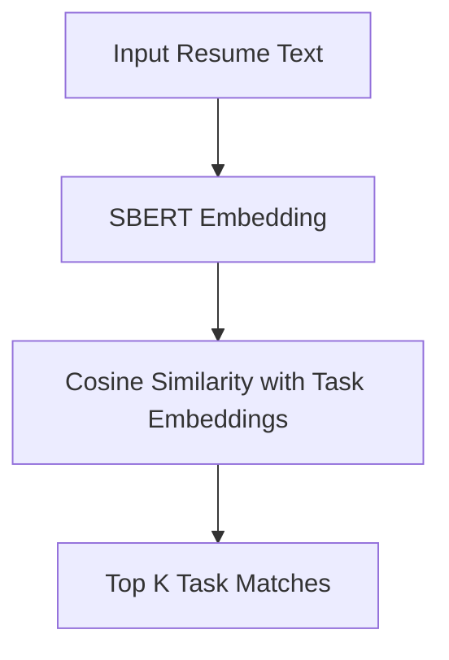

# 🤖 AutoOps AI – Skill-to-Task Matcher

A smart AI system that analyzes job roles, responsibilities, and resumes to match employee skills with specific tasks. Built to help organizations automate workforce planning, reduce redundancy, and increase productivity.

---

## 🎯 Problem Statement
Manual workforce mapping is inefficient, subjective, and error-prone. Companies struggle to:
- Match employee skills to exact tasks
- Avoid overlapping responsibilities
- Identify automation opportunities

**AutoOps AI** solves this by using NLP and embeddings to build an objective skill-to-task mapping engine.

---

## 🧠 Solution Overview
This project uses:
- SBERT (Sentence-BERT) to embed job roles and task descriptions
- Cosine similarity to measure alignment
- A ranking engine to recommend best task matches for each skill or resume

---

## ✅ Example Output

**Input Resume Snippet:**
> "Led deployment of scalable APIs using Python and Docker for logistics systems."

**Top 3 Task Matches:**
1. "Develop and deploy containerized microservices using Docker" – Score: 0.87
2. "Design backend APIs for logistics tracking" – Score: 0.85
3. "Implement scalable backend services using Python" – Score: 0.82

---

## 📂 Project Structure
```
AutoOps-Skill-to-Task-Matcher/
├── data/
│   └── sample_tasks.json
├── scripts/
│   └── skill_task_matcher.py
├── notebook/
│   └── Skill_to_Task_Demo.ipynb
├── requirements.txt
├── README.md
```

---

## 📊 Visual Workflow



---

## 🚀 How to Use
1. Clone the repo:
```bash
git clone https://github.com/sandy-1329/AutoOps-Skill-to-Task-Matcher
```

2. Open the Colab notebook or run the Python script with a sample resume:
```bash
cd scripts
python skill_task_matcher.py
```

---

## 🔧 Tech Stack
- Python
- SBERT (`sentence-transformers`)
- Numpy
- Streamlit (optional for UI)

---

## 📄 Report
📘 Full academic PDF report: [AutoOps_AI_Report.pdf](https://github.com/sandy-1329/AutoOps-Skill-to-Task-Matcher/blob/main/AutoOps_AI_Report.pdf)

---

## 👤 Author
**Venkata Sandeep Kumar Reddy**  
🔗 [LinkedIn](https://www.linkedin.com/in/venkatasandeep/) | 🌐 [Portfolio](#) *(coming soon)*
